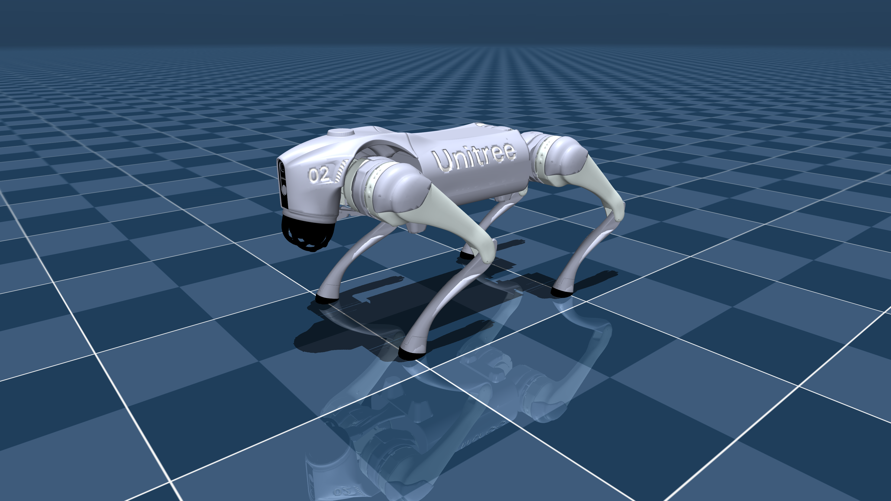

# Unitree Go2 Description with Cane (MJCF)

Requires MuJoCo 2.2.2 or later.

## Overview

This package contains a simplified robot description (MJCF) of the [Go2
Quadruped Robot](https://www.unitree.com/products/go2/) developed by [Unitree
Robotics](https://www.unitree.com/). It is derived from the [publicly available
URDF
description](https://github.com/unitreerobotics/unitree_ros/tree/master/robots/go2_description).

### Cane Addition

The model includes an L-shaped cane structure attached to the back of the robot for force/torque sensing and balance experiments. The cane consists of:

- **Vertical Cylinder**: 0.8m tall, 0.03m diameter thin cylinder extending upward from the back of the robot
- **Horizontal Handle**: 0.5m long thin cylinder at the top, perpendicular to the vertical cylinder, forming an L-shape
- **Force-Torque Sensors**: Native MuJoCo sensors measure forces and torques at the cane base connection:
  - `cane_force`: Measures forces (3D vector) applied to the cane
  - `cane_torque`: Measures torques (3D vector) at the connection point
  - `cane_pos`: Position of the cane base body
  - `cane_quat`: Orientation of the cane base body

The cane is connected to the robot base via free joints, allowing full 3D motion while the force-torque sensors capture interaction forces. This setup allows the robot to sense and compensate for external forces applied to the cane handle, enabling equilibrium and balance control experiments.

  

## URDF → MJCF derivation steps

1. Converted the DAE [mesh
   files](https://github.com/unitreerobotics/unitree_mujoco/tree/main/data/a1/meshes)
   to OBJ format using [Blender](https://www.blender.org/).

- When exporting, ensure "up axis" is `+Z`, and "forward axis" is `+Y`.

2. Processed `.obj` files with [`obj2mjcf`](https://github.com/kevinzakka/obj2mjcf).
3. Added `<mujoco> <compiler discardvisual="false" strippath="false" fusestatic="false"/> </mujoco>` to the URDF's
   `<robot>` clause in order to preserve visual geometries.
4. Loaded the URDF into MuJoCo and saved a corresponding MJCF.
5. Added a `<freejoint/>` to the base.
6. Manually edited the MJCF to extract common properties into the `<default>` section.
7. Softened the contacts of the feet to approximate the effect of rubber and
   increased `impratio` to reduce slippage.
8. Added `scene.xml` which includes the robot, with a textured groundplane, skybox, and haze.
9. Added cane structure with L-shaped geometry and force-torque sensors for external force measurement.

## License

This model is released under a [BSD-3-Clause License](LICENSE).
